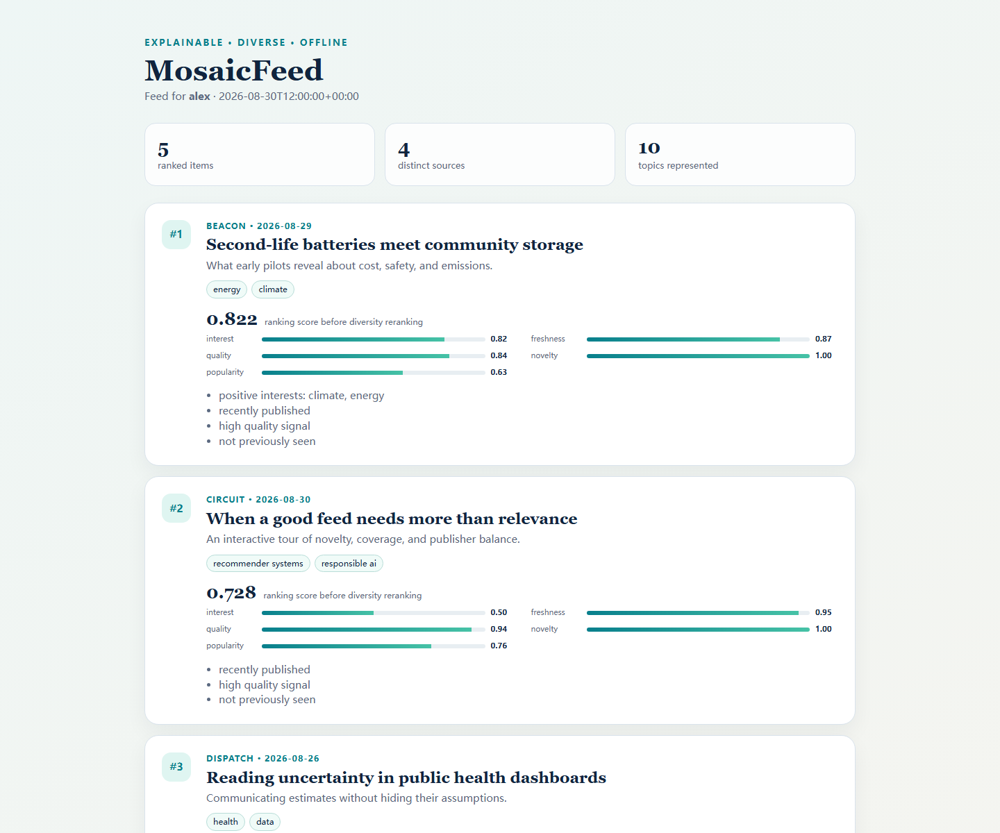
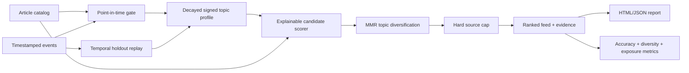

# MosaicFeed

[](https://github.com/appleweiping/MosaicFeed/actions/workflows/ci.yml)
[](https://github.com/appleweiping/MosaicFeed/actions/workflows/codeql.yml)
[](https://www.python.org/)
[](LICENSE)

MosaicFeed is an explainable, diversity-aware laboratory for building and evaluating personalized content feeds. It turns timestamped views, clicks, likes, and hides into a decayed topic profile; scores every eligible article with inspectable evidence; and constructs a slate that balances relevance with topical novelty and source limits.

Everything runs offline with the Python standard library. There are no API keys, model downloads, hidden network calls, or nondeterministic process hashes.



## Why it exists

A useful feed is a slate, not a sorted column. A pure relevance ranking can repeat one topic or publisher, amplify already-popular items, leak future interactions into evaluation, and make debugging almost impossible. MosaicFeed keeps those decisions separate and visible:

1. **Profile** — decay historical signals into signed topic preferences.
2. **Score** — combine interest, freshness, quality, novelty, popularity, and controlled exploration.
3. **Rerank** — apply maximal marginal relevance (MMR) and a hard per-source cap.
4. **Evaluate** — replay temporal holdouts and report accuracy, diversity, coverage, exposure inequality, and logged-policy diagnostics.

## Features

- Time-aware implicit-feedback profiles with configurable event strengths and half-life.
- Negative feedback from `hide` events instead of treating every interaction as positive.
- Future-item and future-event exclusion at a caller-supplied point in time.
- Decomposed score evidence and plain-language reasons for every recommendation.
- Stable exploration based on SHA-256, reproducible across machines and processes.
- MMR topical reranking plus hard source concentration limits.
- Cold-start behavior that falls back to item-side quality, recency, and popularity.
- Temporal leave-last-out evaluation with NDCG, hit rate, MRR, intra-list diversity, source diversity, catalog coverage, exposure Gini, and self-normalized IPS CTR.
- Paired policy benchmarks against popularity, recency, and unconstrained-relevance baselines with deterministic bootstrap confidence intervals.
- Strict JSON/JSONL validation, CLI workflows, synthetic-data generation, and portable HTML reports.
- Zero runtime dependencies and typed, immutable public models.

## Quick start

```bash
python -m venv .venv
source .venv/bin/activate          # Windows: .venv\Scripts\activate
python -m pip install -e .

mosaicfeed validate \
  --articles examples/articles.json \
  --events examples/events.json

mosaicfeed recommend \
  --articles examples/articles.json \
  --events examples/events.json \
  --user alex \
  --as-of 2026-08-30T12:00:00Z \
  --config examples/config.json \
  --output feed.json \
  --html feed.html
```

Each result includes its score decomposition:

```json
{
  "article_id": "article-battery-reuse",
  "rank": 1,
  "score": 0.8221258513763996,
  "breakdown": {
    "interest": 0.8187297915466485,
    "freshness": 0.8655365610061431,
    "quality": 0.84,
    "novelty": 1.0,
    "popularity": 0.63,
    "reasons": ["positive interests: climate, energy", "recently published"]
  }
}
```

## Architecture



| Module | Responsibility |
|---|---|
| `models` | Immutable articles, events, profiles, score evidence, and feeds |
| `profile` | Event semantics, exponential decay, signed topic normalization |
| `scoring` | Candidate eligibility and decomposed pointwise ranking |
| `rerank` | Slate-level topic novelty and publisher constraints |
| `pipeline` | One-call point-in-time feed generation |
| `metrics` | Ranking, diversity, catalog, exposure, and IPS diagnostics |
| `simulation` | Seeded local datasets for demos and smoke benchmarks |
| `io` | Strict JSON/JSONL parsing and stable serialization |
| `report` | Self-contained, script-free HTML review dashboard |
| `cli` | Reproducible validation, recommendation, evaluation, and simulation |

## Scoring

The pre-reranking score is a normalized weighted sum:

```text
s = wi·interest + wf·freshness + wq·quality
  + wn·novelty + wp·popularity + we·exploration
```

All components are bounded to `[0, 1]`; weights are non-negative and normalized by their sum. Freshness and interaction history use independent, configurable half-lives. Interest values preserve the effect of negative signals, then map signed preference to the score interval. Exploration is a small, stable per-user/per-article value—not global randomness.

MMR then selects each next item using:

```text
λ · relevance − (1 − λ) · maximum_topic_similarity_to_selected
```

The hard `max_per_source` constraint is checked before each selection. A constrained feed may contain fewer than the requested size; MosaicFeed never silently relaxes the cap.

### Calibrated slates

MMR rewards a slate whose items are unlike *each other*. That is not the same as
a slate that looks like the reader. Set `rerank_strategy` to `calibrated` to
select against the gap between the reader's topic distribution and the slate's,
following Steck (2018):

```json
{"rerank_strategy": "calibrated", "calibration_weight": 0.5}
```

The difference is not subtle. For a reader whose history is about four fifths
one topic and one fifth another, over a corpus spanning five topics:

| strategy | calibration KL | intra-list diversity | slate topic mix |
|---|---:|---:|---|
| `mmr` (default) | 0.362 | 0.667 | 60% politics, 10% each of culture, science, sports, tech |
| `calibrated` | 0.000 | 0.356 | 80% politics, 20% sports |

MMR reaches three topics the reader has **no history for at all**, and scores
*higher* on intra-list diversity while doing it. That is the trade, and both
numbers are reported so it can be reviewed rather than assumed: calibration is
not a free improvement, it is a different objective.

`calibration_error` measures the gap for any slate, whichever reranker built it,
so the two strategies can be compared on the same footing. It is a smoothed KL
divergence in nats, zero when the proportions match. The smoothing matters: a
topic the slate misses entirely would otherwise be infinite, which says only
"something is missing" and cannot rank two imperfect slates against each other.

A reader's negative topic weights take no share of the distribution. They record
what to push away, which is not the same as a proportion to serve.

The hard `max_per_source` cap applies under either strategy, and neither is
allowed to relax it. Asking for `calibrated` without a profile is refused rather
than falling back to MMR, because the two build different slates and a silent
substitution would leave nothing in the output to show which one ran.

## Offline evaluation

```bash
mosaicfeed evaluate \
  --articles examples/articles.json \
  --events examples/events.json \
  --as-of 2026-08-30T12:00:00Z \
  --config examples/config.json \
  --k 5
```

For every user, the evaluator holds out the last click or like, trains only on strictly earlier events,
exposes only articles already published at the holdout time, and attempts to recover the held-out item.
Slate metrics use the top `k`, and catalog coverage uses the union of items temporally eligible at the
evaluated holdouts. This is a diagnostic—not an online experiment or a causal claim. See
[evaluation design](docs/evaluation.md) for metric definitions and interpretation.

## Synthetic experiments

Generate a deterministic local fixture without downloading a dataset:

```bash
mosaicfeed simulate --directory scratch --seed 41 --users 50 --articles 500
mosaicfeed evaluate \
  --articles scratch/articles.json \
  --events scratch/events.json \
  --as-of 2026-01-15T12:00:00Z
```

Synthetic interactions are intended for smoke tests and demonstrations. They do not establish real-world recommendation quality.

## Policy benchmark

Compare the configured policy against three declared baselines on exactly the same point-in-time holdouts:

```bash
mosaicfeed benchmark \
  --articles examples/articles.json \
  --events examples/events.json \
  --as-of 2026-08-30T12:00:00Z \
  --config examples/config.json \
  --k 5 --bootstrap-samples 1000 --confidence 0.95 --seed 17 \
  --output benchmark.json --html benchmark.html
```

The JSON records a SHA-256 fingerprint of all ranking-relevant input fields, aggregate policy metrics,
percentile intervals for the five user-level metrics plus resampled catalog coverage and exposure Gini,
paired MosaicFeed-minus-baseline intervals, and diagnostic runtime. Every policy uses the same user
resample in each draw, including for the nonlinear slate-wide metrics. Bootstrap resampling is
deterministic for a declared seed. A confidence interval is sampling uncertainty for this replay
population; it does not remove selection bias or make the offline result causal. Logged IPS CTR remains
a point diagnostic because the current report does not retain the per-user propensity log needed for a
valid paired interval.

## MIND dataset adapter

MosaicFeed can convert locally obtained MIND `news.tsv` and `behaviors.tsv` files without downloading
or redistributing the dataset:

```bash
mosaicfeed import-mind \
  --news /data/MIND/news.tsv \
  --behaviors /data/MIND/behaviors.tsv \
  --catalog-published-at 2019-01-01T00:00:00Z \
  --behavior-utc-offset -8 \
  --directory scratch/mind
```

The explicit catalog time and UTC offset are required because MIND omits article publication times and
stores behavior timestamps without a timezone. MIND also omits publisher identity, so the adapter uses
news category as a source proxy. It converts clicked impressions into click events, while recording—but
not pretending to timestamp—undated history entries. Obtain MIND from its official distributor and
follow its license; no MIND data is included in this repository.

## Python API

```python
from datetime import UTC, datetime

from mosaicfeed import FeedConfig, build_feed
from mosaicfeed.io import load_articles, load_events

feed = build_feed(
    "alex",
    load_articles("examples/articles.json"),
    load_events("examples/events.json"),
    as_of=datetime(2026, 8, 30, 12, tzinfo=UTC),
    config=FeedConfig(size=5, max_per_source=2),
)
```

## Data contracts

Dates must be ISO-8601 strings with explicit timezones. Article IDs must be unique. Unknown or duplicate
object fields and non-finite JSON numbers are rejected to catch schema drift early. Events referencing a
missing article are rejected by the `validate` command; the profile builder itself ignores unknown
historical IDs so old logs can still be replayed against a pruned catalog.

See [design and invariants](docs/design.md) for the complete point-in-time rules and [examples](examples/) for executable inputs.

## Responsible use

MosaicFeed is research and prototyping infrastructure, not a production policy. Item-side `quality` and `popularity` are caller-provided signals and can encode bias. Before deployment, define their provenance, measure exposure by relevant groups, add policy-specific safety constraints, validate latency and failure behavior, and run an online experiment with informed oversight. Explanations describe this ranker’s inputs; they are not causal explanations of user behavior.

## Development

```bash
python -m pip install -e ".[dev]"
ruff check .
mypy src
pytest --cov=mosaicfeed --cov-branch --cov-report=term-missing
python -m build
```

The test suite covers model invariants, time leakage, negative feedback, deterministic scoring, constraint enforcement, metrics, strict I/O, CLI behavior, simulation, and report generation. CI runs the suite on Python 3.11, 3.12, and 3.13.

## References

- Carbonell, J. & Goldstein, J. (1998). *The use of MMR, diversity-based reranking for reordering documents and producing summaries.* SIGIR.
- Steck, H. (2018). *Calibrated recommendations.* RecSys.
- Järvelin, K. & Kekäläinen, J. (2002). *Cumulated gain-based evaluation of IR techniques.* ACM TOIS.
- Swaminathan, A. & Joachims, T. (2015). *Counterfactual risk minimization: Learning from logged bandit feedback.* ICML.

These citations identify standard algorithms and evaluation concepts. MosaicFeed’s package design, implementation, examples, and documentation were created for this repository.

## License

[MIT](LICENSE)
