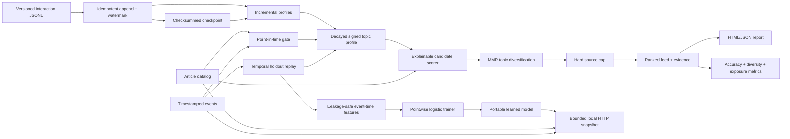

# MosaicFeed

[](https://github.com/appleweiping/MosaicFeed/actions/workflows/ci.yml)
[](https://github.com/appleweiping/MosaicFeed/actions/workflows/codeql.yml)
[](https://www.python.org/)
[](LICENSE)

MosaicFeed is an explainable, diversity-aware laboratory for building, evaluating, and locally serving personalized content feeds. It turns timestamped views, clicks, likes, and hides into a decayed topic profile; scores every eligible article with inspectable evidence; and constructs a slate that balances relevance with topical novelty and source limits.

Training, evaluation, and data preparation run offline with the Python standard library. The optional inference command opens only an explicit HTTP listener (loopback by default); it makes no outbound calls and needs no vendor API key or model download.


## Why it exists

A useful feed is a slate, not a sorted column. A pure relevance ranking can repeat one topic or publisher, amplify already-popular items, leak future interactions into evaluation, and make debugging almost impossible. MosaicFeed keeps those decisions separate and visible:

1. **Profile** — decay historical signals into signed topic preferences.
2. **Score** — combine interest, freshness, quality, novelty, popularity, and controlled exploration.
3. **Rerank** — apply maximal marginal relevance (MMR) and a hard per-source cap.
4. **Evaluate** — replay temporal holdouts and report accuracy, diversity, coverage, exposure inequality, and logged-policy diagnostics.

## Features

- Time-aware implicit-feedback profiles with configurable event strengths and half-life.
- Negative feedback from `hide` events instead of treating every interaction as positive.
- Future-item and future-event exclusion at a caller-supplied point in time.
- Decomposed score evidence and plain-language reasons for every recommendation.
- Stable exploration based on SHA-256, reproducible across machines and processes.
- MMR topical reranking plus hard source concentration limits.
- Cold-start behavior that falls back to item-side quality, recency, and popularity.
- Temporal leave-last-out evaluation with NDCG, hit rate, MRR, intra-list diversity, source diversity, catalog coverage, exposure Gini, and self-normalized IPS CTR.
- Paired policy benchmarks against popularity, recency, and unconstrained-relevance baselines with deterministic bootstrap confidence intervals.
- A fitted pointwise logistic click/like ranker whose training features are built only from each event's prior history, with strict portable model state.
- An opt-in impression-aware pairwise ranker for clicked versus displayed-unclicked MIND candidates, with raw-logit scores and a disjoint post-cutoff evaluation workflow.
- An opt-in impression-aware listwise softmax ranker over each complete displayed MIND candidate set, with a distinct raw-logit model format and held-out workflow.
- A bounded, deterministic HTTP inference API over a frozen model/catalog/history snapshot, with loopback-safe defaults and optional bearer authentication.
- A versioned append-only interaction stream with idempotent ingestion, per-user watermarks, incremental profile updates, deterministic late-event rebuilds, and checksummed checkpoint/replay.
- Strict JSON/JSONL validation, CLI workflows, synthetic-data generation, and portable HTML reports.
- Zero runtime dependencies and typed, immutable public models.

## Quick start

```bash
python -m venv .venv
source .venv/bin/activate          # Windows: .venv\Scripts\activate
python -m pip install -e .

mosaicfeed validate \
  --articles examples/articles.json \
  --events examples/events.json

mosaicfeed recommend \
  --articles examples/articles.json \
  --events examples/events.json \
  --user alex \
  --as-of 2026-08-30T12:00:00Z \
  --config examples/config.json \
  --output feed.json \
  --html feed.html

mosaicfeed train-click-model \
  --articles examples/articles.json \
  --events examples/events.json \
  --as-of 2026-08-30T12:00:00Z \
  --output click-model.json

mosaicfeed rank-click-model \
  --model click-model.json \
  --articles examples/articles.json \
  --events examples/events.json \
  --user alex \
  --as-of 2026-08-30T12:00:00Z \
  --k 5

mosaicfeed serve-click-model \
  --model click-model.json \
  --articles examples/articles.json \
  --events examples/events.json

curl --fail-with-body http://127.0.0.1:8080/v1/rank \
  -H 'Content-Type: application/json' \
  --data '{"user_id":"alex","as_of":"2026-08-30T12:00:00Z","k":3}'

mosaicfeed stream-ingest \
  --articles examples/articles.json \
  --log scratch/interactions.jsonl \
  --input examples/interaction-events.jsonl \
  --checkpoint scratch/profiles.checkpoint.json

mosaicfeed stream-replay \
  --articles examples/articles.json \
  --log scratch/interactions.jsonl \
  --checkpoint scratch/profiles.checkpoint.json \
  --as-of 2026-08-30T12:00:00Z
```

Each result includes its score decomposition:

```json
{
  "article_id": "article-battery-reuse",
  "rank": 1,
  "score": 0.8221258513763996,
  "breakdown": {
    "interest": 0.8187297915466485,
    "freshness": 0.8655365610061431,
    "quality": 0.84,
    "novelty": 1.0,
    "popularity": 0.63,
    "reasons": ["positive interests: climate, energy", "recently published"]
  }
}
```

## Architecture



| Module | Responsibility |
|---|---|
| `models` | Immutable articles, events, profiles, score evidence, and feeds |
| `profile` | Event semantics, exponential decay, signed topic normalization |
| `scoring` | Candidate eligibility and decomposed pointwise ranking |
| `rerank` | Slate-level topic novelty and publisher constraints |
| `pipeline` | One-call point-in-time feed generation |
| `metrics` | Ranking, diversity, catalog, exposure, and IPS diagnostics |
| `learning` | Event-time feature construction, logistic training, persistence, and learned ranking |
| `event_stream` | Versioned ingestion, deduplication, watermarks, incremental profiles, checkpoints, and replay |
| `server` | Frozen click-model snapshot, strict HTTP protocol, authentication, and resource ceilings |
| `simulation` | Seeded local datasets for demos and smoke benchmarks |
| `io` | Strict JSON/JSONL parsing and stable serialization |
| `report` | Self-contained, script-free HTML review dashboard |
| `cli` | Reproducible validation, recommendation, evaluation, and simulation |

## Scoring

The pre-reranking score is a normalized weighted sum:

```text
s = wi·interest + wf·freshness + wq·quality
  + wn·novelty + wp·popularity + we·exploration
```

All components are bounded to `[0, 1]`; weights are non-negative and normalized by their sum. Freshness and interaction history use independent, configurable half-lives. Interest values preserve the effect of negative signals, then map signed preference to the score interval. Exploration is a small, stable per-user/per-article value—not global randomness.

MMR then selects each next item using:

```text
λ · relevance − (1 − λ) · maximum_topic_similarity_to_selected
```

The hard `max_per_source` constraint is checked before each selection. A constrained feed may contain fewer than the requested size; MosaicFeed never silently relaxes the cap.

### Calibrated slates

MMR rewards a slate whose items are unlike *each other*. That is not the same as
a slate that looks like the reader. Set `rerank_strategy` to `calibrated` to
select against the gap between the reader's topic distribution and the slate's,
following Steck (2018):

```json
{"rerank_strategy": "calibrated", "calibration_weight": 0.5}
```

The difference is not subtle. For a reader whose history is about four fifths
one topic and one fifth another, over a corpus spanning five topics:

| strategy | calibration KL | intra-list diversity | slate topic mix |
|---|---:|---:|---|
| `mmr` (default) | 0.362 | 0.667 | 60% politics, 10% each of culture, science, sports, tech |
| `calibrated` | 0.000 | 0.356 | 80% politics, 20% sports |

MMR reaches three topics the reader has **no history for at all**, and scores
*higher* on intra-list diversity while doing it. That is the trade, and both
numbers are reported so it can be reviewed rather than assumed: calibration is
not a free improvement, it is a different objective.

`calibration_error` measures the gap for any slate, whichever reranker built it,
so the two strategies can be compared on the same footing. It is a smoothed KL
divergence in nats, zero when the proportions match. The smoothing matters: a
topic the slate misses entirely would otherwise be infinite, which says only
"something is missing" and cannot rank two imperfect slates against each other.

A reader's negative topic weights take no share of the distribution. They record
what to push away, which is not the same as a proportion to serve.

The hard `max_per_source` cap applies under either strategy, and neither is
allowed to relax it. Asking for `calibrated` without a profile is refused rather
than falling back to MMR, because the two build different slates and a silent
substitution would leave nothing in the output to show which one ran.

## Offline evaluation

```bash
mosaicfeed evaluate \
  --articles examples/articles.json \
  --events examples/events.json \
  --as-of 2026-08-30T12:00:00Z \
  --config examples/config.json \
  --k 5
```

For every user, the evaluator holds out the last click or like, trains only on strictly earlier events,
exposes only articles already published at the holdout time, and attempts to recover the held-out item.
Slate metrics use the top `k`, and catalog coverage uses the union of items temporally eligible at the
evaluated holdouts. This is a diagnostic—not an online experiment or a causal claim. See
[evaluation design](docs/evaluation.md) for metric definitions and interpretation.

## Synthetic experiments

Generate a deterministic local fixture without downloading a dataset:

```bash
mosaicfeed simulate --directory scratch --seed 41 --users 50 --articles 500
mosaicfeed evaluate \
  --articles scratch/articles.json \
  --events scratch/events.json \
  --as-of 2026-01-15T12:00:00Z
```

Synthetic interactions are intended for smoke tests and demonstrations. They do not establish real-world recommendation quality.

## Policy benchmark

Compare the configured policy against three declared baselines on exactly the same point-in-time holdouts:

```bash
mosaicfeed benchmark \
  --articles examples/articles.json \
  --events examples/events.json \
  --as-of 2026-08-30T12:00:00Z \
  --config examples/config.json \
  --k 5 --bootstrap-samples 1000 --confidence 0.95 --seed 17 \
  --output benchmark.json --html benchmark.html
```

The JSON records a SHA-256 fingerprint of all ranking-relevant input fields, aggregate policy metrics,
percentile intervals for the five user-level metrics plus resampled catalog coverage and exposure Gini,
paired MosaicFeed-minus-baseline intervals, and diagnostic runtime. Every policy uses the same user
resample in each draw, including for the nonlinear slate-wide metrics. Bootstrap resampling is
deterministic for a declared seed. A confidence interval is sampling uncertainty for this replay
population; it does not remove selection bias or make the offline result causal.

Logged IPS CTR now carries an interval of its own, from a bootstrap that resamples **users** and
pools their observations. The sampling unit is the user because one user contributes many
correlated events; resampling events instead treats repeated impressions from one heavy user as
independent observations. The committed synthetic regression demonstrates that event resampling
can make the interval materially too narrow. It is not a valid substitute for cluster resampling.

The estimator is self-normalized, so it is a ratio of two random sums rather than a mean, and each
resample recomputes the whole ratio over the pooled observations. The report also carries Kish's
effective sample size and the share of total weight carried by the single heaviest observation,
because a self-normalized estimate can rest almost entirely on a handful of observations when the
logging propensities were small. Below a tenth of the observations the summary marks itself
`concentrated`.

An interval is withheld, with a stated reason rather than a silent zero, when fewer than three
users carry a propensity: a bootstrap over one cluster resamples the same cluster every time and
reports zero width, which reads as certainty rather than as having one user. None of this makes
the result causal, and none of it corrects a propensity model that was wrong.

## Local ablation registry

Run declared one-factor ablations on identical temporal holdouts, then store
the metrics and exact input-byte provenance in a content-addressed record:

```bash
mosaicfeed run-ablation \
  --articles examples/articles.json --events examples/events.json \
  --plan examples/ablation-plan.json --registry scratch/ablation-registry
```

Records are never overwritten. Paired confidence intervals share the same
resampled users across variants. This is an offline feed-config diagnostic,
not checkpoint selection or a MIND-small result. See the
[ablation registry contract](docs/ablation-registry.md) for plan names, bounds,
provenance, and limitations.

## Local training experiments

For caller-owned MIND-shaped splits, `run-training-experiment` trains 2–8
declared pairwise/listwise candidates on train only, evaluates the same
post-cutoff validation impressions, and stores every checkpoint and metric in
one no-overwrite, replay-verifiable record. The tiny bundled input is
hand-written synthetic data, not an official MIND sample:

```bash
mosaicfeed run-training-experiment \
  --articles examples/training_experiment_articles.json \
  --train examples/training_experiment_train.json \
  --validation examples/training_experiment_validation.json \
  --plan examples/training_experiment_plan.json \
  --registry scratch/training-experiment-registry
```

See the [training experiment contract](docs/training_experiments.md) for
selection semantics, bounds, provenance, checkpoint loading, and limitations.
It is not an official MIND benchmark or an untouched-test estimate.

## Declared-cohort audit

Compare utility, slate diversity, and pre-holdout topic calibration across
caller-declared cohorts without inferring demographic labels:

```bash
mosaicfeed audit-cohorts \
  --articles examples/articles.json --events examples/events.json \
  --cohorts examples/cohorts.json --as-of 2026-08-30T12:00:00Z \
  --k 3 --minimum-group-size 1 --bootstrap-samples 100 \
  --output cohort-audit.json
```

The size-one example is a synthetic smoke test, not a responsible real-world
fairness threshold. [The cohort-audit guide](docs/cohort-audit.md) details the
strict mapping, missing-evidence semantics, confidence intervals, and limits
on causal interpretation.

Compare multiple declared policies on those same holdouts and inspect a
five-objective point-estimate Pareto frontier:

```bash
mosaicfeed compare-cohort-policies \
  --articles examples/articles.json --events examples/events.json \
  --cohorts examples/cohorts.json \
  --plan examples/cohort-policy-plan.json \
  --output cohort-policy-frontier.json
```

Missing calibration or a single cohort makes the affected frontier objectives
undefined, not zero. See the [policy-frontier guide](docs/cohort-policy-frontier.md)
for constraints, exact source hashes, tie handling, and limitations. The
example remains synthetic, not an official benchmark or causal fairness claim.

## MIND dataset adapter

MosaicFeed can convert locally obtained MIND `news.tsv` and `behaviors.tsv` files without downloading
or redistributing the dataset:

```bash
mosaicfeed import-mind \
  --news /data/MIND/news.tsv \
  --behaviors /data/MIND/behaviors.tsv \
  --catalog-published-at 2019-01-01T00:00:00Z \
  --behavior-utc-offset -8 \
  --directory scratch/mind
```

The explicit catalog time and UTC offset are required because MIND omits article publication times and
stores behavior timestamps without a timezone. MIND also omits publisher identity, so the adapter uses
news category as a source proxy. It converts clicked impressions into click events, while recording—but
not pretending to timestamp—undated history entries. The conversion also retains every impression's
ordered candidate set and binary labels in `impressions.json`; source-file SHA-256 values are written to
`metadata.json` together with the normalized catalog time and behavior UTC offset needed to replay the
conversion. Each source is read once into a bounded immutable byte snapshot;
records and SHA-256 values are derived from those same bytes instead of being
accepted as independently supplied provenance.

Scores in strict long-form JSON can then be evaluated without reconstructing lost non-click candidates:

```bash
mosaicfeed evaluate-mind \
  --impressions scratch/mind/impressions.json \
  --scores examples/mind_scores.json \
  --cutoff 5 --cutoff 10 \
  --output scratch/mind/evaluation.json
```

The report contains macro impression AUC, MRR and nDCG at the declared cutoffs, exact score-coverage
validation, deterministic tie handling, and fingerprints of the normalized labels and scores. The formulas
follow the public MIND evaluator; [the complete contract](docs/mind-evaluation.md) documents the one
intentional clarification for tied scores, hand-calculated golden cases, and a fixed-seed 200-case
independent cross-check. Obtain MIND from its
official distributor and follow its research license; no MIND data is included in this repository.

For a hash-checked train/dev experiment on user-supplied MIND-small ZIPs or
extracted directories, see the [offline MIND-small workflow](docs/mind-small-workflow.md).
It trains a bounded pairwise baseline and writes a model, candidate-complete
validation scores, and a provenance report. Its default earliest-prefix sample
is not a full-dataset or official leaderboard result.

## Python API

```python
from datetime import UTC, datetime

from mosaicfeed import FeedConfig, build_feed
from mosaicfeed.io import load_articles, load_events

feed = build_feed(
    "alex",
    load_articles("examples/articles.json"),
    load_events("examples/events.json"),
    as_of=datetime(2026, 8, 30, 12, tzinfo=UTC),
    config=FeedConfig(size=5, max_per_source=2),
)
```

## Data contracts

Dates must be ISO-8601 strings with explicit timezones. Article IDs must be unique. Unknown or duplicate
object fields and non-finite JSON numbers are rejected to catch schema drift early. Events referencing a
missing article are rejected by the `validate` command; the profile builder itself ignores unknown
historical IDs so old logs can still be replayed against a pruned catalog.

See [design and invariants](docs/design.md) for the complete point-in-time rules and [examples](examples/) for executable inputs.

### Incremental event stream

The ordinary `events.json`/JSONL history remains the simple offline interchange.
For incremental updates with explicit recovery semantics, the versioned stream adds a globally unique
`event_id`, explicit positive `weight`, canonical append-only storage, and
bounded exactly-once behavior within one store. Per-user accumulators follow a
declared watermark policy; accepted out-of-order data rebuilds only affected
users. A checkpoint binds derived state to an exact log byte offset, prefix
digest, event-chain digest, catalog/config digest, and independently verifiable
event list.

The authoritative log is never replaced by a checkpoint. A torn final record is
reported and blocks writes unless the operator explicitly requests recovery;
corrupt complete records are never skipped. Symbolic links and files with
more than one hard link are rejected before replay, append, or recovery. Use
one writer process per log.
See the full [event-stream and recovery contract](docs/event-stream.md), including
resource ceilings and the explicit export/restart boundary for HTTP snapshots.

Commands that publish several ordinary outputs (`recommend`, `benchmark`,
`simulate`, `import-mind`, and `stream-replay`) stage and flush every file before
changing any destination. If a later replacement fails, earlier destinations
are restored from same-directory backups. If a recovery rename also fails, its
backup is retained and the recovery failure is attached to the original
exception. The writer reconciles destination identity even when the operating
system reports an exception after a rename has already taken effect. Individual renames are atomic, but
readers can observe intermediate states across directories, and crash or power
loss guarantees depend on the operating system, filesystem, and storage device.

## Learned click model

`PointwiseLogisticRanker` adds a real fitted ranking path while retaining the
standard-library-only contract. For every training event it reconstructs the
user profile from strictly earlier events, computes the same seven declared
features (`bias`, interest, freshness, quality, novelty, popularity, and stable
exploration), and performs seeded SGD with L2 regularization. Clicks and likes
are positive labels; views and hides are negative labels.

The model requires both label classes and rejects unknown articles, events that
predate publication, future-only training sets, non-finite hyperparameters, and
tampered state. Equal event timestamps use input order as an explicit tie rule.
Its JSON state records the exact feature names, `FeedConfig`, training cutoff,
class counts, hyperparameters, fitted weights, and a SHA-256 digest of the exact
event-time feature/label matrix consumed by SGD. Because the event log does
not necessarily contain complete candidate sets, this model is explicitly
pointwise and does not claim a pairwise/listwise or causal objective.

An opt-in `train-click-model --text-features` path adds a frozen, bounded
title/category/subcategory TF-IDF vocabulary and a prior-history text affinity
feature for cold-start news; the default seven-feature model and schema remain
unchanged. Provide `--text-vocabulary-articles train-news.json` for a declared,
multi-document training-news snapshot available before the first training
event; without it, the safe fallback uses only that first event's article.
See the [text feature contract](docs/text-features.md) for MIND
empty-title handling, leakage boundaries, and limitations.

For a distinct within-impression objective, see the
[pairwise impression contract](docs/pairwise-impressions.md). It keeps every
displayed candidate for MIND score round trips, requires an explicit training
partition and cutoff, and reports raw logits rather than click probabilities.
The separate [listwise impression contract](docs/listwise-impressions.md)
optimizes one softmax distribution over each logged candidate slate and keeps
the same point-in-time and disjoint held-out boundaries.

### Local HTTP inference

`serve-click-model` loads and validates a fitted model, catalog, and history once,
then serves that private immutable snapshot. `POST /v1/rank` requires an explicit
timezone-aware `as_of`; no server clock enters a ranking response. An optional
`candidate_ids` array limits what is scored without removing other catalog items
from profile history. Events at `as_of` are included, later events and later
articles are excluded, probabilities tie-break by article ID, and identical
snapshot/request pairs serialize identically.

The listener defaults to `127.0.0.1:8080`. Authentication is enabled only through
a caller-named environment variable, never a command-line token:

```bash
export MOSAICFEED_TOKEN='replace-with-a-long-random-value'
mosaicfeed serve-click-model \
  --model click-model.json \
  --articles examples/articles.json \
  --events examples/events.json \
  --token-env MOSAICFEED_TOKEN
```

Non-loopback binding is rejected unless `--allow-nonloopback` and a non-empty
`--token-env` are both supplied. This small standard-library server is intended
for one trusted machine or a controlled development network, not direct Internet
exposure. Request bytes, response bytes, `k`, candidates, catalog rows, history
events, file bytes, and concurrent workers have explicit ceilings. Socket I/O has
a timeout, while ranking uses a monotonic cooperative deadline checked at bounded
intervals through validation, profile construction, and candidate scoring. See the
complete [HTTP inference protocol](docs/http-inference.md) and
[security policy](SECURITY.md) before changing binding or limit options.

## Responsible use

MosaicFeed is research and prototyping infrastructure, not a production policy. Item-side `quality` and `popularity` are caller-provided signals and can encode bias. Before deployment, define their provenance, measure exposure by relevant groups, add policy-specific safety constraints, validate latency and failure behavior, and run an online experiment with informed oversight. Explanations describe this ranker’s inputs; they are not causal explanations of user behavior.

## Development

```bash
python -m pip install -e ".[dev]"
ruff check .
mypy src
pytest --cov=mosaicfeed --cov-branch --cov-report=term-missing
python scripts/verify_branch_coverage.py
python -m build
```

The test suite covers model invariants, event-time training leakage, learned-state
tampering, hand-checkable label behavior, negative feedback, deterministic
scoring, constraint enforcement, metrics, strict I/O, real loopback HTTP,
authentication and resource failures, CLI behavior, simulation, and report
generation. It also checks event idempotency/conflicts, a hand-calculated profile
oracle, shuffled replay equivalence, late data, log/checkpoint tampering, torn
tail recovery, resource ceilings, and threaded ingestion. CI runs the suite on
Python 3.11, 3.12, and 3.13.

See [the release process](docs/releasing.md) for clean-install, SBOM, checksum,
and build-provenance guarantees.

## References

- Carbonell, J. & Goldstein, J. (1998). *The use of MMR, diversity-based reranking for reordering documents and producing summaries.* SIGIR.
- Steck, H. (2018). *Calibrated recommendations.* RecSys.
- Järvelin, K. & Kekäläinen, J. (2002). *Cumulated gain-based evaluation of IR techniques.* ACM TOIS.
- Swaminathan, A. & Joachims, T. (2015). *Counterfactual risk minimization: Learning from logged bandit feedback.* ICML.
- Wu, F. et al. (2020). *MIND: A large-scale dataset for news recommendation.* ACL.

These citations identify standard algorithms and evaluation concepts. MosaicFeed’s package design, implementation, examples, and documentation were created for this repository.

## License

[MIT](LICENSE)
